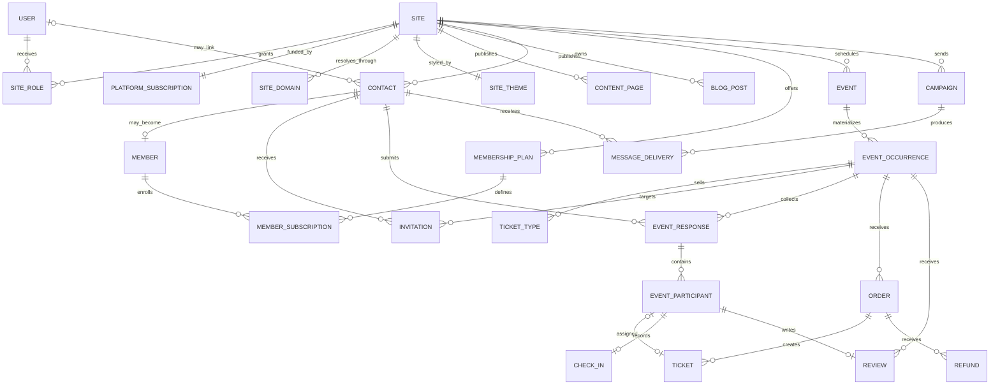

# Event Management Platform V1 Specification

Status: Approved product baseline; ready for implementation planning  
Last updated: July 28, 2026  
Source: `Event_Management_Platform_Project_Scope.docx` and the initial product-discovery decisions

## 1. Executive summary

The Event Management Platform is a low-cost, multi-tenant SaaS product for informal groups and emerging local brands. Its first real customer is a country line dancing group whose leader needs one place to publish a small branded website, schedule events, invite contacts, collect RSVPs and payments, communicate with attendees, and understand attendance and revenue.

Each paying subscriber receives one website at:

`{site-slug}.{platform-domain}`

The subscriber does not need to operate a registered business. A site can represent a group, host, instructor, club, or emerging brand. Subscriber billing is separate from money collected for event tickets or member dues.

V1 will be a mobile-friendly web application built as a Django modular monolith using the repository's existing PostgreSQL and Redis foundation. Native mobile applications are deferred.

## 2. Confirmed product decisions

| Area | V1 decision |
| --- | --- |
| Initial market | Country line dancing groups, with reusable terminology for other informal groups |
| Tenant model | One subscriber site per paid platform subscription |
| Platform plan | One feature tier; price TBD |
| Trial | Fourteen days, with no payment card required to start |
| Site address | `{site-slug}.{platform-domain}`; custom domains are deferred |
| Platform revenue | Subscription fee only; no event or member-payment platform fee |
| Paid transactions | Stripe Connect; subscriber receives ticket and member-dues revenue |
| Event types | Single and recurring scheduled events |
| Event visibility | Public, unlisted, and invite-only |
| RSVP states | Going, maybe, and not going |
| Guests | Supported, including named guests and individual attendance tracking |
| Websites | Small template-based site with brand controls and fixed page types |
| Communications | Transactional email, email campaigns/newsletters, and outbound SMS |
| Attendance | Mobile-friendly manual check-in |
| Membership | Members are distinct from attendees; monthly and yearly dues are supported |
| Reviews | Verified attendees can review completed events |
| Mobile | Responsive web application only in V1 |
| Scale baseline | 100 sites, 5,000 contacts per site, 1,000 attendees per event, and 100 concurrent registrations/check-ins |

## 3. Product language

Customer-facing language should avoid implying that subscribers must run formal businesses.

| Term | Meaning |
| --- | --- |
| Platform | The SaaS product operated by the platform owner |
| Site | One subscriber's branded website and isolated tenant space |
| Group leader | The subscriber admin who owns the subscription |
| Site manager | A person allowed to operate a site without controlling its subscription or Stripe connection |
| Contact | A site-specific person in the audience or address book; an account is not required |
| Account holder | A person with a reusable platform login who can participate across multiple sites |
| Member | A contact with a group membership record, potentially including recurring dues |
| Attendee | A person registered for a specific event occurrence |
| Guest | A named attendee registered by another person |

The internal code may use `tenant` or `organization` where technically helpful, but the interface should prefer `site`, `group`, and `group leader`.

## 4. Goals and non-goals

### 4.1 V1 goals

1. Let a group leader start a free trial and publish a useful branded site without needing a registered company or a Stripe Connect account.
2. Let managers publish single or recurring events to a public calendar.
3. Let contacts respond from secure invitation links without first creating passwords.
4. Let account holders register themselves and named guests for free or paid events.
5. Route ticket and membership payments to the subscriber's connected Stripe account without a platform fee.
6. Give subscribers practical contact, RSVP, attendance, communication, revenue, membership, and review reporting.
7. Keep operating and development costs proportional to early adoption.

### 4.2 Explicitly deferred

- Community discussion forums, groups, chat, photo sharing, and document libraries
- Artificial intelligence features
- Native iOS and Android applications
- Badge printing
- QR-code check-in
- Surveys
- Public API and third-party integration marketplace
- Inline CBL page builder
- Arbitrary page layouts
- Custom subscriber-owned domains and premium domain options
- Contact imports and historical-data migrations
- Browser push notifications
- Two-way SMS inboxes
- Seat maps and assigned seating
- Ticket transfers
- Coupons, payment plans, and event waitlists
- Advanced class/course and organization-specific domain models

Deferred capabilities should not force premature abstractions into V1. The V1 model should preserve stable extension points, particularly site domains, event occurrences, payments, and outbound messages.

## 5. Actors and permissions

### 5.1 Actors

- **Platform admin:** operates the SaaS platform, supports subscribers, moderates reviews, and manages platform-level configuration.
- **Subscriber admin:** owns a site and its subscription, connects Stripe, appoints managers, manages membership plans, and controls all site content and events.
- **Site manager:** manages the public site, contacts, events, invitations, communications, registrations, and check-in, but cannot control the platform subscription, Stripe connection, or other managers.
- **Account holder:** manages their profile, RSVPs, guests, orders, tickets, membership, communication preferences, and reviews across sites.
- **Contact:** exists within one site and can receive invitations without having a platform account.
- **Guest:** is registered by an account holder or contact and does not require an account.

### 5.2 Permission matrix

| Capability | Platform admin | Subscriber admin | Site manager | Account holder/contact |
| --- | :---: | :---: | :---: | :---: |
| Manage platform settings and subscribers | Yes | No | No | No |
| Create and suspend sites | Yes | Own site | No | No |
| Manage platform subscription | Support | Yes | No | No |
| Connect or disconnect Stripe | Support | Yes | No | No |
| Invite/remove site managers | Support | Yes | No | No |
| Edit theme, pages, and blog | Support | Yes | Yes | No |
| Manage contacts and members | Support | Yes | Yes | Own record only |
| Create and manage events | Support | Yes | Yes | No |
| Send invitations/newsletters/SMS | Support | Yes | Yes | No |
| Issue refunds | Support/audit | Yes | No by default | Request only |
| Check in attendees | Support | Yes | Yes | No |
| View site reports | Support | Yes | Yes | Own activity only |
| Submit an event review | No | If verified attendee | If verified attendee | If verified attendee |
| Moderate reported reviews | Yes | Respond/report | Respond/report | Report |

All authorization is site-scoped. A role on one site grants no access to another site.

## 6. Core user journeys

### 6.1 Subscriber trial and site launch

1. A group leader creates an email-based account and verifies the address.
2. The leader starts a fourteen-day trial without entering card information.
3. The leader chooses a unique site slug, display name, template, logo, colors, and default timezone.
4. The platform creates one site and assigns the leader the subscriber-admin role.
5. The leader edits the fixed site pages and publishes the site.
6. Before the trial expires, the platform sends reminder emails.
7. The leader enters a payment method and begins the single paid plan, or the site becomes suspended at trial end.

### 6.2 Free open event

1. A manager creates an event and one or more occurrences.
2. The manager marks it public, configures capacity and guest rules, and publishes it.
3. A visitor opens the event page and chooses going, maybe, or not going.
4. A going attendee supplies required details and any guest names.
5. The system confirms the registration and updates capacity and dashboard totals.
6. On event day, a manager checks in the primary attendee and guests individually.

### 6.3 Invitation-only event

1. A manager creates an invite-only occurrence and selects contacts.
2. Background workers send individualized email or SMS links.
3. A recipient opens a signed, expiring link and responds without creating a password.
4. The response is tied to the site's contact record.
5. The recipient may optionally create or link a reusable platform account.
6. Invite-only pages do not expose attendee or event details to unauthorized visitors.

### 6.4 Paid event

1. The subscriber connects an eligible Stripe account through Stripe-hosted onboarding.
2. A manager creates ticket types, price, quantity, sales window, refund policy, and guest limit for an event occurrence.
3. A purchaser selects tickets and assigns a name to every attendee.
4. Stripe-hosted checkout collects payment on the connected account.
5. A verified webhook marks the order paid and creates confirmed tickets.
6. The subscriber's connected account is responsible for Stripe processing fees, refunds, and chargebacks; the platform takes no application fee.
7. Refunds update the local order, ticket, registration, attendance, and reporting state through idempotent webhook processing.

### 6.5 Member dues

1. A subscriber admin creates a monthly or yearly membership plan.
2. A contact joins the plan using checkout associated with the subscriber's connected account.
3. Webhooks maintain active, past-due, canceled, and expired membership states.
4. Membership never automatically marks a person as attending an event.
5. A member still responds or registers for each event occurrence.

### 6.6 Blog and newsletter

1. A manager drafts and publishes a blog post.
2. A manager creates a newsletter independently or uses a blog post as its starting content.
3. The manager selects an eligible audience, previews the message, and schedules or sends it.
4. The system excludes unsubscribed or otherwise ineligible recipients.
5. Delivery, bounce, open, and click events update campaign reporting when the selected provider supplies them.

### 6.7 Verified review

1. After an event occurrence ends, a checked-in attendee can submit one review.
2. The review contains a one-to-five rating and optional written comment.
3. The subscriber can post one public response or report the review.
4. The subscriber cannot silently remove or edit an attendee's review.
5. A platform admin can hide or restore a review with a recorded moderation reason.

## 7. Functional requirements

### 7.1 Accounts and identity

- **ACC-01:** Email is the unique global login identifier.
- **ACC-02:** The platform supports registration, email verification, login, logout, password reset, and account deactivation.
- **ACC-03:** One user can have roles and contact records on multiple sites.
- **ACC-04:** Contacts and guests do not require platform accounts.
- **ACC-05:** A verified account can claim a matching site contact record through a controlled linking flow.
- **ACC-06:** Invitation-response tokens are random, hashed at rest, scoped to one invitation, expiring, and revocable.

### 7.2 Site tenancy and domains

- **SITE-01:** One platform subscription owns exactly one site.
- **SITE-02:** Every tenant-owned record carries an immutable `site_id` or is reachable only through a site-owned parent.
- **SITE-03:** A site slug is globally unique, normalized, reserved-word checked, and change-restricted after publication.
- **SITE-04:** Host resolution uses an explicit domain record rather than concatenating untrusted request values.
- **SITE-05:** The data model supports future custom domains, but V1 only provisions platform subdomains.
- **SITE-06:** Sites have draft, trialing, active, grace, suspended, canceled, and archived lifecycle states as applicable.

### 7.3 Platform subscriptions

- **SUB-01:** V1 exposes one feature tier with a configurable Stripe price identifier and display price.
- **SUB-02:** A fourteen-day trial starts when the first site is created and does not require a card.
- **SUB-03:** Trial-ending reminders are sent before expiration.
- **SUB-04:** A trial without an active payment method is suspended at expiration; its admin can still reach billing and recovery screens.
- **SUB-05:** A failed paid renewal receives a seven-day grace period before suspension.
- **SUB-06:** Cancellation takes effect at the end of the paid billing period unless platform support performs an immediate exceptional cancellation.
- **SUB-07:** Suspended or canceled site data is retained for 90 days before it becomes eligible for deletion.
- **SUB-08:** SMS usage is metered separately from the single feature tier; no unlimited SMS promise is made.

### 7.4 Site builder and publishing

- **WEB-01:** A subscriber selects from a small set of maintained templates.
- **WEB-02:** Theme controls include site name, logo, primary/secondary colors, hero image, and approved typography choices.
- **WEB-03:** Initial page types are Home, About, Events/Calendar, Blog, Newsletter signup, and Contact.
- **WEB-04:** Managers can edit page content and navigation labels within template-defined regions.
- **WEB-05:** Pages support draft, published, and scheduled publication states.
- **WEB-06:** Public pages include basic title, description, social-sharing image, canonical URL, and sitemap metadata.
- **WEB-07:** Uploaded images are validated, resized, and stored outside the application filesystem in production.

### 7.5 Contacts and members

- **CRM-01:** Managers can manually create, edit, archive, search, and tag contacts.
- **CRM-02:** A registration or invitation response can create or update a site contact without overwriting manager-owned notes.
- **CRM-03:** Normalized email is unique per site when present; intentional email-less contacts are allowed.
- **CRM-04:** Member records are distinct from platform users and event attendees.
- **CRM-05:** Member status is derived from administrative state and, when applicable, recurring-payment state.
- **CRM-06:** Subscriber admins can define monthly and yearly membership plans.
- **CRM-07:** Managers can view membership history but cannot see full payment credentials.
- **CRM-08:** Contact consent, unsubscribe, and suppression history is auditable.

### 7.6 Events and calendar

- **EVT-01:** Managers can create, edit, publish, cancel, archive, and duplicate events.
- **EVT-02:** A single event has one occurrence; a recurring event materializes multiple occurrences from a recurrence rule.
- **EVT-03:** Every occurrence stores its own start, end, timezone, venue, capacity, sales window, status, and optional overrides.
- **EVT-04:** Editing a recurring event supports changing one occurrence, the selected and future occurrences, or the entire series.
- **EVT-05:** RSVP, ticket inventory, registration, attendance, and reviews are occurrence-specific.
- **EVT-06:** Visibility is public, unlisted, or invite-only.
- **EVT-07:** Capacity counts confirmed going participants, including guests; maybe and not-going responses do not reserve capacity.
- **EVT-08:** Event pages show clear date, timezone, venue, host, pricing, availability, guest policy, refund policy, and accessibility/contact information.
- **EVT-09:** Cancellation notifies affected registrants and triggers the subscriber's configured refund workflow for paid tickets.

### 7.7 Invitations, responses, and guests

- **RSVP-01:** Responses are going, maybe, or not going.
- **RSVP-02:** A contact has at most one current primary response per occurrence.
- **RSVP-03:** Invite-only responses require a valid invitation or an authorized manager override.
- **RSVP-04:** Public and unlisted events can require account creation or allow contact-level registration according to a site setting; the default is low-friction contact registration.
- **RSVP-05:** Each event sets a maximum guest count, including zero.
- **RSVP-06:** First and last name are required for every guest; guest email and phone are optional.
- **RSVP-07:** Going responses create one participant for the primary attendee and one participant for each guest.
- **RSVP-08:** Paid events assign one paid ticket to each participant.
- **RSVP-09:** Changing a response recalculates capacity without losing audit history.
- **RSVP-10:** Confirmations and reminders show every registered participant and the current payment state.

### 7.8 Ticketing, orders, and refunds

- **PAY-01:** Paid event and member-dues features remain disabled until Stripe reports the connected account ready for the required payment capability.
- **PAY-02:** Direct charges are created in the subscriber's connected-account context with no application fee.
- **PAY-03:** Each order records site, occurrence, purchaser, currency, immutable line-item snapshots, totals, provider identifiers, and status.
- **PAY-04:** Ticket inventory is reserved only for a short checkout window and confirmed only after payment success.
- **PAY-05:** Every paid participant receives an individually identifiable ticket record.
- **PAY-06:** Subscriber admins can issue full or partial refunds within provider and business-policy limits.
- **PAY-07:** Refunds never delete financial history; they append state transitions and provider references.
- **PAY-08:** Webhook processing verifies signatures, records provider account context, is idempotent, and tolerates out-of-order delivery.
- **PAY-09:** The system does not store raw card numbers or bank credentials.
- **PAY-10:** Currency is configured per site for V1; an order cannot mix currencies.

### 7.9 Communications

- **COM-01:** Transactional messages include verification, invitations, RSVP confirmations, ticket receipts, event updates, reminders, cancellations, subscription notices, and password resets.
- **COM-02:** Managers can create, preview, test, schedule, send, and duplicate email campaigns.
- **COM-03:** Initial audiences include all eligible contacts, members, non-members, event invitees, response status, registration status, and manually selected tags.
- **COM-04:** Marketing email requires recorded consent and always includes unsubscribe controls.
- **COM-05:** Transactional and marketing consent are evaluated separately.
- **COM-06:** Outbound SMS requires explicit SMS consent and honors suppression immediately.
- **COM-07:** SMS estimates recipient count and expected usage before confirmation.
- **COM-08:** Large sends execute through background jobs with batching, retries, rate limits, and per-recipient delivery records.
- **COM-09:** Provider callbacks update sent, delivered, bounced, failed, opened, clicked, and unsubscribed states when supported.

### 7.10 Blog and newsletter

- **BLOG-01:** Managers can draft, preview, publish, schedule, unpublish, and archive blog posts.
- **BLOG-02:** Posts support title, slug, excerpt, body, featured image, author display name, and publication time.
- **BLOG-03:** Published posts appear on the site's blog index and have stable public URLs.
- **BLOG-04:** A blog post can seed newsletter content without linking the publication and delivery lifecycles.
- **BLOG-05:** Newsletter signup records consent source, timestamp, and site.

### 7.11 Attendance

- **ATT-01:** A mobile-friendly roster supports search, response/ticket filters, and large tap targets.
- **ATT-02:** Managers can check in or undo check-in for each primary attendee and guest independently.
- **ATT-03:** Check-in records actor, timestamp, occurrence, and optional note.
- **ATT-04:** Duplicate check-ins are prevented while corrections remain auditable.
- **ATT-05:** QR scanning is not required in V1.

### 7.12 Reviews

- **REV-01:** Only a checked-in participant may review an occurrence after its end time.
- **REV-02:** A participant may submit one one-to-five-star review with an optional comment.
- **REV-03:** Review edits preserve an audit timestamp; deleted user content is soft-deleted according to policy.
- **REV-04:** A subscriber admin or manager may publish one response and may report a review.
- **REV-05:** Site staff cannot hide a review solely because it is negative.
- **REV-06:** Platform admins can hide or restore reported content and must record a moderation reason.
- **REV-07:** Public aggregate ratings include only visible reviews and disclose the review count.

### 7.13 Reporting

- **REP-01:** The site dashboard shows registration totals, response conversion, participant/guest counts, capacity, attendance, and no-show rate.
- **REP-02:** Financial reports show ticket gross revenue, Stripe-reported fees when available, refunds, net amounts, and member-dues revenue without implying platform accounting authority.
- **REP-03:** Membership reports show active, trialing if later supported, past-due, canceled, and expired members.
- **REP-04:** Campaign reports show delivery, bounce, open, click, unsubscribe, and SMS failure totals when supported by the provider.
- **REP-05:** Event comparison reports aggregate registrations, attendance, revenue, and ratings.
- **REP-06:** Reports are computed from authoritative transactional records; cached summaries can improve performance but cannot replace source data.

### 7.14 Platform administration

- **ADM-01:** Platform admins can locate users and sites, view lifecycle/payment status, suspend access, and inspect audit history.
- **ADM-02:** Support access to tenant data is explicit, least-privileged, and audited.
- **ADM-03:** Platform admins can review failed webhooks, background jobs, email/SMS delivery failures, and connected-account readiness.
- **ADM-04:** Review moderation actions require a reason.
- **ADM-05:** Destructive site deletion is delayed until the retention period ends and runs as a separately authorized operation.

## 8. Business rules

### 8.1 Trial and subscription lifecycle

```text
draft -> trialing -> active -> grace -> suspended -> archived -> deletion eligible
                    |           ^
                    +-----------+  successful recovery
```

- Trial access includes normal product features so subscribers can evaluate real events.
- A subscriber can defer Stripe Connect while running free events.
- Trial expiry without platform payment suspends public access and manager operations, while leaving subscriber-admin billing and data export/recovery access available.
- A paid renewal failure enters a seven-day grace period before suspension.
- The application must respond to Stripe webhooks rather than treating a browser redirect as proof of payment.

### 8.2 Platform billing versus subscriber commerce

Two financial contexts must remain separate:

1. **Platform subscription:** the platform charges the group leader the TBD recurring SaaS fee using the platform Stripe account.
2. **Subscriber commerce:** ticket and membership payments are created for the subscriber's connected Stripe account with no application fee.

No local model or report may combine these balances as if they shared a merchant account. Provider identifiers must always include the relevant connected-account context.

Stripe documents that direct charges live on the connected account and that the connected account can be responsible for processing fees, refunds, and chargebacks. The implementation must select and verify a Connect configuration that preserves this confirmed business rule in each supported country:

- [Stripe: Create direct charges](https://docs.stripe.com/connect/direct-charges)
- [Stripe: Fee behavior on connected accounts](https://docs.stripe.com/connect/direct-charges-fee-payer-behavior)
- [Stripe: Connect subscriptions](https://docs.stripe.com/connect/subscriptions)
- [Stripe: Subscription trials](https://docs.stripe.com/billing/subscriptions/trials)

### 8.3 Paid registration

- Starting checkout does not equal registration confirmation.
- Temporary inventory holds expire automatically.
- Successful provider events confirm the order, tickets, participant records, and going response in one idempotent application transaction.
- A maybe response never holds inventory.
- If inventory is exhausted before payment confirmation, the system follows a tested reconciliation path and alerts operations rather than silently overselling.

### 8.4 Recurrence

- Recurrence generates occurrence records inside a bounded horizon; it does not calculate an infinite series during every request.
- Responses, tickets, capacity, check-in, cancellations, and reviews attach to an occurrence.
- Exceptions preserve their relationship to the series.
- Changing future recurrence does not rewrite completed or financially active occurrences.

### 8.5 Reviews

- Verification is based on recorded check-in, not merely an invitation or purchase.
- Review moderation is content-safety moderation, not reputation management.
- Average ratings must be recomputed or transactionally updated when visibility changes.

## 9. Data model

### 9.1 Relationship overview



### 9.2 Entity catalog

All primary keys should be non-sequential public-safe identifiers, preferably UUIDs. Human-readable slugs remain separate fields. Timestamps use timezone-aware UTC storage.

| Entity | Purpose and important fields |
| --- | --- |
| `User` | Global email login; name, verification state, active/staff flags, security timestamps |
| `Site` | Tenant root; display name, slug, timezone, currency, lifecycle, template, publication state |
| `SiteDomain` | Host mapping; hostname, type, verification status, canonical flag; platform subdomain in V1 |
| `SiteRole` | User-to-site role assignment; subscriber admin or site manager, inviter, active dates |
| `PlatformSubscription` | Platform Stripe customer/subscription/price IDs, trial dates, status, grace deadline, cancellation dates |
| `SiteTheme` | Logo/media references, color tokens, typography choice, template version |
| `ContentPage` | Fixed page type, title, slug, structured template-region content, SEO fields, publish state |
| `BlogPost` | Site, author, title, slug, excerpt, body, featured image, publication state/time |
| `Contact` | Site-scoped person; optional linked user, normalized email/phone, names, tags, notes, archive state |
| `ConsentRecord` | Contact, channel/purpose, granted or withdrawn, source, timestamp, evidence metadata |
| `Member` | Contact membership identity; administrative status, start/end dates, notes |
| `MembershipPlan` | Site-defined monthly/yearly plan; name, amount, currency, provider product/price IDs, active flag |
| `MemberSubscription` | Member-plan enrollment; connected-account customer/subscription IDs, status and billing dates |
| `Event` | Series-level information; site, title, description, recurrence rule, visibility, default settings |
| `EventOccurrence` | Concrete date/time; event, venue, status, capacity, sales/refund windows, occurrence overrides |
| `TicketType` | Occurrence, name, price, currency, quantity, per-order limit, sales window, active state |
| `Invitation` | Occurrence/contact, channel, token digest, sent/opened/responded timestamps, revocation/expiry |
| `EventResponse` | Occurrence/contact, going/maybe/not-going, source, current state and transition timestamps |
| `EventParticipant` | Response, primary/guest type, optional contact, immutable name snapshot, optional contact details |
| `InventoryHold` | Occurrence/ticket type/session, quantity and short expiration for checkout concurrency |
| `Order` | Site/occurrence/purchaser, connected-account context, totals, currency, state, provider IDs |
| `OrderLine` | Immutable ticket-type description, unit amount, quantity, discounts/taxes if later added |
| `Ticket` | Order line and participant assignment, ticket status, display identifier |
| `Refund` | Order/provider refund ID, amount, reason, actor, status and timestamps |
| `CheckIn` | Participant/occurrence, checked-in time, actor, note, reversal metadata |
| `Campaign` | Site, channel, subject/body/template, audience definition snapshot, scheduled/sent state |
| `MessageDelivery` | Campaign/transaction type, contact/address, provider ID, state, attempts and event timestamps |
| `Review` | Occurrence/participant, rating, comment, visibility, edit/report/moderation timestamps |
| `ReviewResponse` | Review, site, author, public response and publication state |
| `WebhookEvent` | Provider, connected-account context, event ID/type, received/processed state, attempt/error data |
| `AuditEvent` | Actor, site, action, target type/ID, timestamp, request metadata, before/after summary |
| `DailySiteMetric` | Optional rebuildable rollup for reporting; site/date/metric dimensions and values |

### 9.3 Critical constraints

- `Site.slug` and active `SiteDomain.hostname` are globally unique.
- A user has at most one active role assignment of each role per site.
- A site has at most one current platform subscription and one subscriber admin owner at launch.
- A contact's normalized email is unique within a site when not null.
- A contact has at most one active member record per site.
- An event response is unique by occurrence and primary contact.
- A checked-in participant has at most one active check-in per occurrence.
- A participant has at most one active ticket per occurrence unless later requirements explicitly allow multi-ticket assignment.
- A verified participant has at most one active review per occurrence.
- Provider event IDs are unique within provider and connected-account context.
- Monetary values use integer minor units plus ISO currency; never binary floating point.

## 10. Application architecture

### 10.1 Architectural style

Use a Django modular monolith with a single PostgreSQL database and shared-schema row-level tenancy.

This is the lowest-cost architecture that fits the initial scale while preserving strong module boundaries. Schema-per-tenant databases, microservices, and a separate JavaScript SPA would add operational cost without solving a current requirement.

Tenant safety must not depend on developers remembering arbitrary filters. Site-aware query services/managers, request context, authorization policies, and cross-tenant automated tests are required from the first tenant-owned model.

### 10.2 Proposed Django modules

| Django app | Responsibility |
| --- | --- |
| `users` | Existing global user model, verification, profile, login security |
| `sites` | Site tenancy, host resolution, domains, themes, role assignments, lifecycle |
| `subscriptions` | Platform trial and paid-plan billing |
| `content` | Template pages, blog, navigation, publishing, media metadata |
| `contacts` | Contacts, consent, tags, members, membership plans/status |
| `events` | Events, recurrence, occurrences, visibility, invitations, responses, participants, capacity |
| `payments` | Stripe Connect readiness, orders, inventory holds, tickets, refunds, member dues, webhooks |
| `communications` | Transactional messages, campaigns, recipient expansion, delivery events, suppression |
| `attendance` | Check-in workflows and attendance audit records |
| `reviews` | Verified reviews, responses, reports, and moderation |
| `reporting` | Dashboard queries, exports added later, and rebuildable metric rollups |
| `ops` | Platform support views, audit events, provider failures, job visibility |

Modules may call explicit service functions in other modules, but should not scatter cross-domain state changes through signals. Use signals only for non-critical notifications or cache invalidation. Financial and capacity state transitions belong in explicit, transaction-wrapped application services.

### 10.3 Request surfaces

```text
Platform/control domain
  - Marketing and subscriber signup
  - Account area across sites
  - Subscriber dashboard and billing
  - Platform administration

Subscriber subdomain
  - Public template site
  - Blog and calendar
  - Event details, invitation response, registration, checkout return
  - Member and attendee self-service
```

A host-resolution middleware maps the normalized request host to `SiteDomain`, attaches the site to the request, and rejects unknown or suspended hosts before tenant-owned queries execute. The platform/control domain follows a separate URL configuration or explicit route namespace.

### 10.4 Frontend

- Django templates and Bootstrap remain the V1 rendering foundation.
- Use progressive enhancement for calendar filtering, registration steps, inline check-in, and dashboard interactions.
- Core publishing, registration, checkout recovery, and account actions must work without requiring a large client-side application bundle.
- Mobile layouts target common phone widths and WCAG 2.2 AA interaction and contrast expectations.
- Public template themes use validated CSS custom-property tokens; subscribers cannot inject arbitrary scripts or CSS in V1.

### 10.5 Background work

Redis supports caching, short-lived locks, rate limits, and a job queue. Add a maintained Django-compatible worker and scheduler, with Celery as the default implementation choice unless an implementation ADR selects another supported worker.

Background jobs handle:

- Email and SMS delivery
- Campaign recipient expansion and batching
- Trial, event, and membership reminders
- Recurring-event occurrence generation
- Expired inventory-hold cleanup
- Stripe reconciliation and webhook retries
- Image processing
- Reporting rollups
- Retention and deletion workflows

Every job must be idempotent, observable, bounded, and safe to retry.

### 10.6 External services

| Capability | V1 approach |
| --- | --- |
| Platform billing | Stripe Billing/Checkout on the platform account |
| Ticket/member payments | Stripe Connect with Stripe-hosted onboarding and connected-account charge context |
| Email | Provider abstraction; vendor TBD before implementation |
| SMS | Provider abstraction; vendor TBD; metered usage and strict opt-in |
| Media | S3-compatible object storage with private originals and public derivatives as appropriate |
| Database | PostgreSQL 16 as currently configured |
| Cache/queue | Redis 7 as currently configured |
| Web application | Django 6/Python 3.13 as currently configured |

### 10.7 Stripe integration boundary

Use a dedicated payments service layer rather than calling Stripe throughout views or models. It owns:

- Platform-customer and subscription operations
- Connect onboarding links and account-readiness synchronization
- Connected-account checkout sessions
- Membership subscriptions created in connected-account context
- Refund commands
- Webhook signature validation, account-context routing, inbox persistence, and idempotent processing
- Provider-to-domain state mapping
- Reconciliation commands and operational alerts

Store provider IDs, but keep domain states independent of provider strings so provider changes and inconsistent webhook ordering remain manageable.

## 11. Security, privacy, and reliability

### 11.1 Security baseline

- Keep Django CSRF, secure cookies, HSTS, clickjacking protection, password validation, and login throttling enabled in production.
- Require verified email before subscriber administration, paid registration history, or review submission.
- Enforce authorization in server-side policies/services; hiding controls in templates is not authorization.
- Add automated cross-site access tests for every tenant-owned read and mutation endpoint.
- Use signed short-lived actions and hashed invitation tokens; avoid permanent bearer links.
- Validate and scan uploaded file types; never trust file extensions or user-provided MIME types.
- Use Stripe-hosted payment collection to minimize payment-data exposure.
- Verify webhook signatures from the raw request body and preserve a deduplicated event inbox.
- Protect provider secrets with environment/secret management and rotate them without code changes.
- Record privileged support access, role changes, refunds, moderation, exports, and deletion actions.

### 11.2 Privacy and consent

- V1 is not designed for minors.
- Keep site-specific contact data isolated even when one global user links to multiple sites.
- Maintain separate consent records for marketing email and SMS.
- Preserve suppression records when contacts are archived so they are not accidentally re-subscribed.
- Provide user-facing profile, communication preference, and account deletion flows.
- Provide subscriber data export and deletion tooling before general launch, even though bulk import is deferred.

### 11.3 Reliability targets

- Registration and check-in writes must use database transactions and concurrency-safe capacity checks.
- Public pages should target a warm-cache p95 response under two seconds at the stated launch scale, excluding third-party checkout.
- Messaging and webhook endpoints acknowledge quickly and move nonessential work to the queue.
- Database backups run at least daily; production hosting should support point-in-time recovery when affordable.
- Health checks cover the application, database, Redis, worker queue, and scheduler.
- Structured logs include request/correlation IDs, site ID, job ID, and provider event ID without recording secrets or raw payment data.

## 12. Reporting definitions

To avoid misleading dashboards, V1 uses explicit definitions:

| Metric | Definition |
| --- | --- |
| Invited | Unique contacts with a sent invitation for the occurrence |
| Responded | Unique invitees with a current going/maybe/not-going response |
| RSVP conversion | Responded divided by delivered invitations; shown with the denominator |
| Registered participants | Primary and guest participants on confirmed going responses |
| Attendance | Participants with an active check-in |
| No-show rate | Confirmed participants not checked in divided by confirmed participants after the event |
| Ticket gross | Sum of successfully paid order lines before refunds |
| Refunded | Sum of successful refunds |
| Ticket net in app | Gross minus refunds; Stripe fees shown separately only when provider data is available |
| Average rating | Mean of visible verified reviews, always displayed with review count |

Financial reports are operational summaries, not tax or accounting statements.

## 13. Development roadmap

The roadmap is ordered by dependency and deployable customer value, not calendar promises.

### Phase 0 - Foundation and decision records

Deliverables:

- Confirm product name, root domain, default currency, and subscription price placeholder
- Establish formatting, test, migration, environment, and CI conventions
- Add architecture decision records for tenancy, background jobs, and Stripe Connect configuration
- Correct production-ready media storage and secrets strategy
- Establish baseline accessibility, security, audit, and observability helpers

Exit gate:

- Existing starter boots in development and production-like settings
- Automated tests run in CI
- No pending migrations
- Security-sensitive configuration fails closed when required environment values are missing

### Phase 1 - Accounts, sites, tenancy, and platform trial

Deliverables:

- Email verification and account lifecycle
- Site, subdomain, role, theme, and lifecycle models
- Subscriber onboarding wizard
- Fourteen-day no-card trial and single-plan billing integration
- Host resolution and tenant-scoping infrastructure
- Subscriber and manager dashboards

Exit gate:

- A new subscriber can create and publish one isolated trial site
- Cross-site access tests demonstrate that users cannot read or mutate another site's data
- Trial activation, reminder, conversion, grace, suspension, recovery, and cancellation webhook paths are tested

### Phase 2 - Template site, content, contacts, blog, and calendar

Deliverables:

- Initial site templates and theme tokens
- Fixed page editor and publishing workflow
- Blog authoring and public blog
- Contact creation, editing, tagging, notes, and consent history
- Single and recurring events with public/unlisted/invite-only visibility
- Public calendar and occurrence pages

Exit gate:

- The country line dancing group can publish its branded site, blog post, and real calendar
- Recurrence exception tests cover one/future/all edit behavior
- Public/unlisted/invite-only access behavior is verified

### Phase 3 - Invitations, RSVP, guests, and attendance

Deliverables:

- Email invitation creation and secure response links
- Going/maybe/not-going flows
- Named guests and capacity enforcement
- Confirmations, updates, cancellations, and reminders
- Mobile-friendly manual roster and individual check-in
- Core attendance and response reporting

Exit gate:

- A manager can invite real contacts and complete a free-event lifecycle from invitation through check-in
- Capacity remains correct under concurrent registration tests
- Primary attendees and guests appear and check in independently

### Phase 4 - Stripe Connect ticketing and member dues

Deliverables:

- Connected-account onboarding and readiness display
- Ticket types, inventory holds, orders, checkout, tickets, and refunds
- Monthly/yearly membership plans and member subscriptions
- Provider webhook inbox, idempotent processing, retry, and reconciliation tooling
- Financial and membership reporting

Exit gate:

- Test-mode direct ticket charges and recurring member dues settle in the intended connected-account context with zero platform application fee
- Subscriber-paid platform billing remains isolated from site commerce
- Payment success, failure, duplicate/out-of-order webhook, refund, dispute visibility, and disconnected-account cases are tested

### Phase 5 - Newsletters, SMS, and delivery analytics

Deliverables:

- Newsletter composer, audience builder, scheduling, and sending
- Blog-to-newsletter starting workflow
- Transactional email templates
- Outbound SMS with consent, estimates, limits, and metering
- Delivery callback processing and campaign reporting

Exit gate:

- Suppressed recipients receive no marketing messages
- Large sends batch without blocking web requests
- Provider failures are visible and safely retryable
- SMS cannot exceed configured site/platform limits without explicit confirmation or credit

### Phase 6 - Reviews, reporting completion, and platform operations

Deliverables:

- Verified event reviews, subscriber responses, reporting, and platform moderation
- Event comparison and consolidated site dashboard
- Platform support, audit, job, webhook, and subscriber-status views
- Data export and retention workflows

Exit gate:

- Only checked-in attendees can review
- Moderation actions are auditable
- Dashboard values reconcile to transactional test fixtures
- Support access and destructive operations are permission-tested

### Phase 7 - Launch hardening

Deliverables:

- End-to-end tests for the primary customer journey
- Load tests at the agreed launch scale
- Accessibility and responsive-device review
- Security review, dependency audit, backup restore test, and failure drills
- Production monitoring, alerting, support runbooks, privacy/terms content, and launch checklist
- Pilot migration of the country line dancing group using manual contact entry

Exit gate:

- Subscriber onboarding through event publication, invitation, paid/free registration, check-in, review, and reporting passes in production-like infrastructure
- Cross-tenant access tests, billing reconciliation, backup restoration, and provider failure recovery pass
- The pilot group can operate a real event without developer database intervention

## 14. Testing strategy

### 14.1 Required test layers

- **Model tests:** constraints, state transitions, money calculations, recurrence, and review eligibility
- **Service tests:** subscription lifecycle, capacity, RSVP changes, checkout confirmation, refund, consent, and campaign batching
- **Authorization tests:** every role across own site, another site, anonymous access, and suspended sites
- **Webhook contract tests:** signature, duplicate, missing, delayed, and out-of-order events with connected-account context
- **Integration tests:** PostgreSQL concurrency, Redis jobs/locks, object storage, Stripe test mode, email, and SMS sandboxes
- **Browser tests:** subscriber onboarding, publishing, invitation response, free and paid registration, check-in, and review
- **Accessibility tests:** keyboard navigation, labels, focus, contrast, error summaries, and screen-reader semantics
- **Load tests:** registration capacity contention, invitation batches, public calendar reads, and check-in search

### 14.2 Non-negotiable regression scenarios

1. A manager cannot access another site by changing a URL identifier.
2. A duplicate payment webhook cannot create duplicate tickets or revenue.
3. Two buyers cannot oversell the last available ticket.
4. A maybe response cannot reserve capacity or receive a ticket.
5. An unsubscribed contact cannot re-enter a marketing campaign through a stale segment.
6. Suspending one site does not disable a global user's access to other sites.
7. Editing future recurrence does not alter completed occurrences or past financial records.
8. A non-attendee cannot submit a verified review.
9. A subscriber cannot use platform billing credentials as a connected payment account.
10. A failed background job can retry without duplicating messages, charges, participants, or check-ins.

## 15. Initial definition of done

A feature is complete only when:

- Product behavior and empty/error states match its acceptance criteria.
- Tenant and role authorization tests exist.
- Mobile layout and keyboard operation have been checked.
- Audit, consent, or financial history is preserved where applicable.
- Background and provider operations are idempotent and observable.
- Migrations work on a clean database and an upgrade fixture.
- Relevant documentation and operational runbooks are updated.
- No secrets, personal information, or raw payment data appear in logs.

## 16. Remaining non-blocking decisions

These values can remain configurable placeholders during the first phases:

- Product name and root domain
- Single-tier price and billing currency
- Final site template visual designs
- Email provider
- SMS provider and customer-facing usage price
- Default event refund policy and cutoff language
- Supported launch country or countries for Stripe Connect
- Production hosting and object-storage vendors
- Legal terms, privacy notice, acceptable-use policy, and review-moderation wording

None of these decisions should change the domain boundaries defined in this specification.
